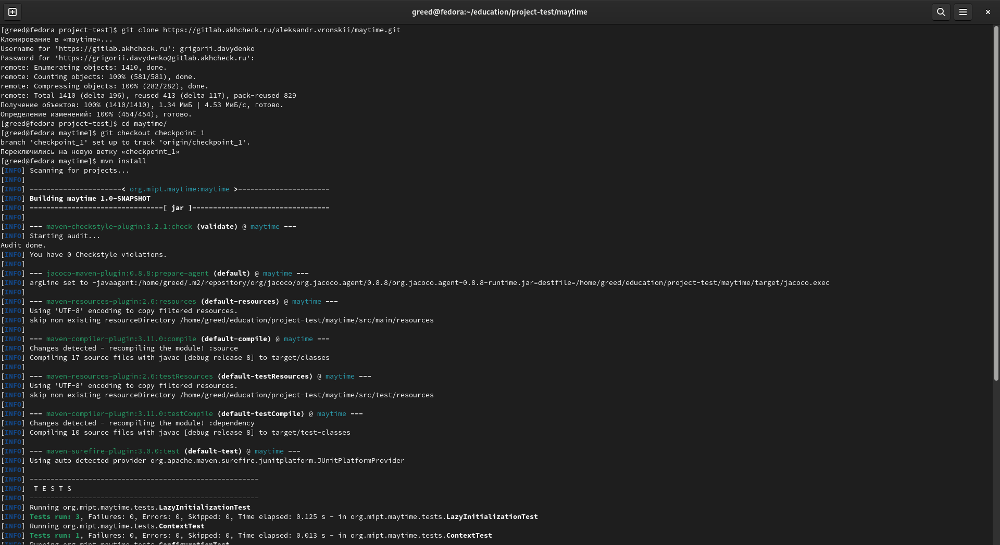
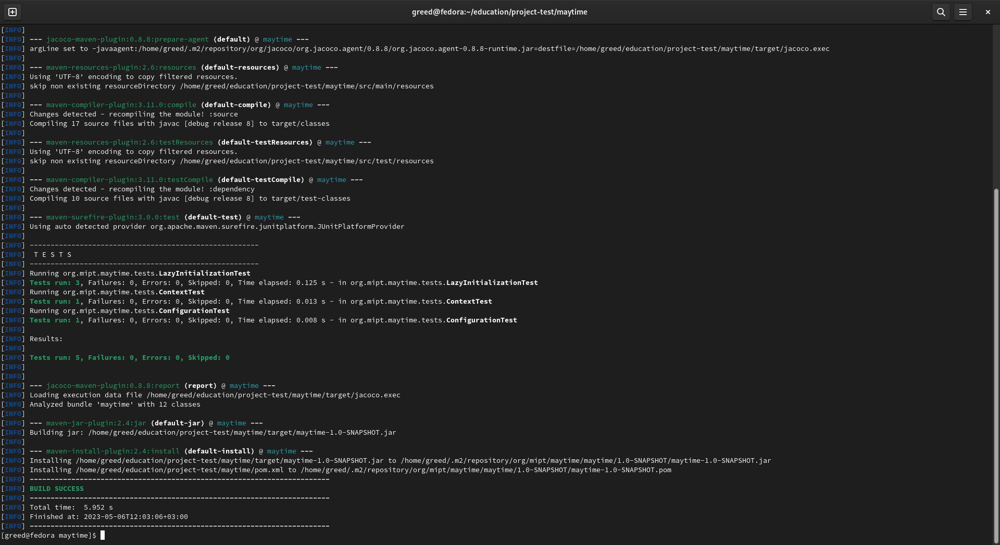
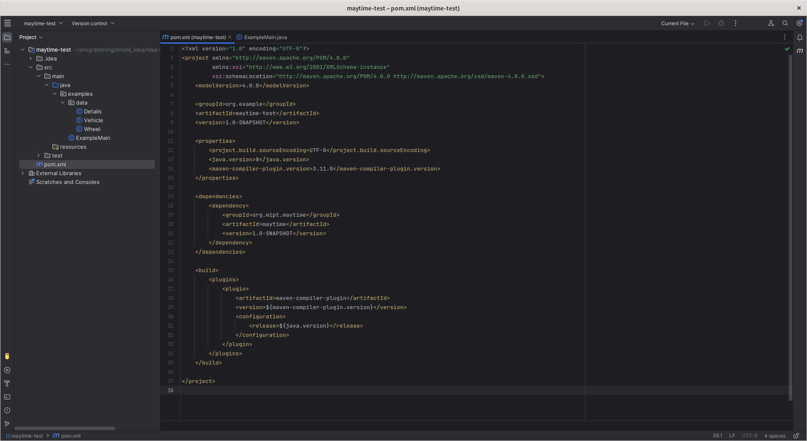
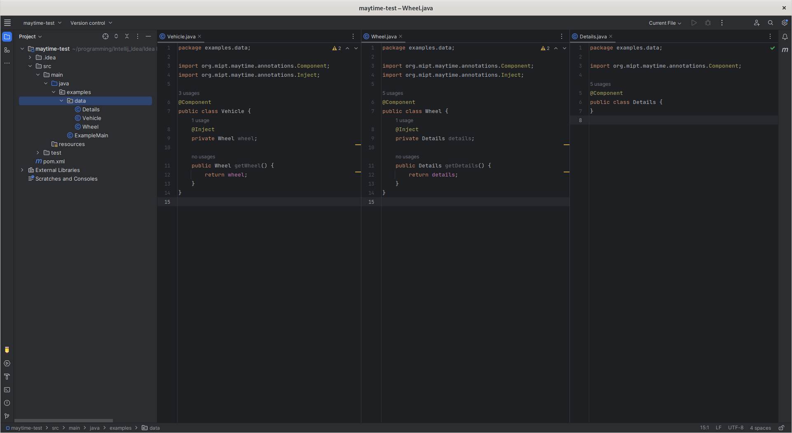
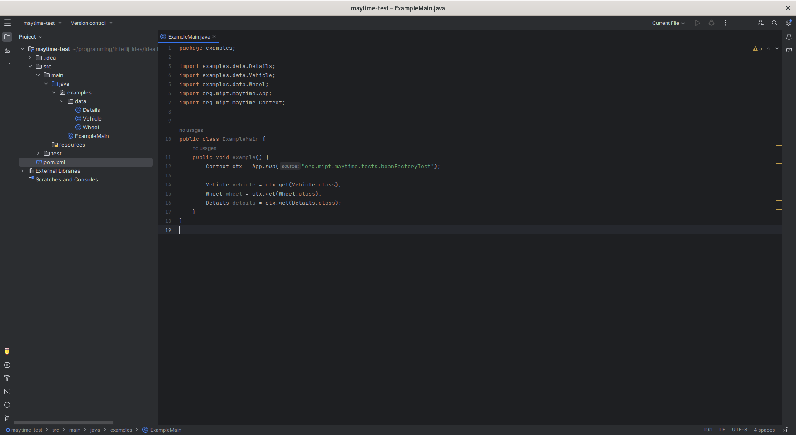

# MAYTIME
### About project

Project Maytime is custom framework which may help you simplify writing Java programs and
improve the quality of your code.

Maytime provides the user with the ability to inject dependencies between objects which
exist in a single instance.

It`s not difficult to notice connection between Maytime project and Spring framework functionality.
Maytime implements two main functions of this framework: inversion of control and dependency injection.
That's why the project has such name - Maytime.

### Requirements

- Java version 1.8+
- Maven - build and management tool for Java-projects

### Usage
#### Step 1: Installation

Before all, clone Maytime in your workspace and run mvn install command:

```
git clone https://gitlab.akhcheck.ru/aleksandr.vronskii/maytime.git
cd maytime
mvn install
```

#### Step 2: Adding a dependency

The next step is to add a dependency to your own project:

```
<dependency>
    <groupId>org.mipt.maytime</groupId>
    <artifactId>maytime</artifactId>
    <version>1.0-SNAPSHOT</version>
</dependency>
```

#### Step 3: Import required classes

After adding a dependency, you may import the following classes to configure maytime work:

```
import org.mipt.maytime.App;
import org.mipt.maytime.Context;
import org.mipt.maytime.annotations.Component;
import org.mipt.maytime.annotations.Inject;
import org.mipt.maytime.annotations.Bean;
import org.mipt.maytime.annotations.Configuration;
import org.mipt.maytime.annotations.LazyInitialization;
```

#### Step 4: Configuration

Annotate classes which you want to manage with Context using @Component annotation.  
Annotate the fields which you want to fill with components using the @Inject annotation.

Annotate classes which produces singletons using @Configuration annotation and methods-producers using @Bean.

If you want to create class instance in runtime you may also add @LazyInitialization annotation.

#### Step 5: Start your application

Create context with the following command:

```
Context ctx = App.run("your.package.name");
```

You can get annotated component classes using Context.getBean():

```
YourClass object = ctx.getBean(YourClass.class);
```

You can restart context with App.restart():

```
App.restart("your.package.name");
```

### Usage examples
#### Installation

  


#### Dependency



#### Annotated classes



#### Context



### Authors:

- *Davydenko Grigorii*
  - GitLab: *@grigorii.davydenko*
  - Telegram: *@desertSmoke42*
- *Vronskii Alexander*
  - GitLab: *@aleksandr.vronskii*
  - Telegram: *@asvronsky*
